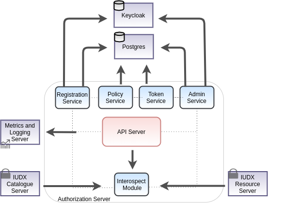

[](https://jenkins.iudx.io/job/iudx%20aaa-server%20(master)%20pipeline/lastBuild/)
[](https://jenkins.iudx.io/job/iudx%20aaa-server%20(master)%20pipeline/lastBuild/jacoco/)
[](https://jenkins.iudx.io/job/iudx%20aaa-server%20(master)%20pipeline/lastBuild/testReport/)
[](https://jenkins.iudx.io/job/iudx%20aaa-server%20(master)%20pipeline/lastBuild/zap/)
[](https://jenkins.iudx.io/job/iudx%20aaa-server%20(master)%20pipeline/Integration_20Test_20Report/)


# India Urban Data eXchange (IUDX) Authentication, Authorization, and Accounting (AAA) Server

IUDX-AAA is the Authentication, Authorization, and Accounting server for accessing [IUDX](https://www.iudx.org.in) services.

<p align="center">

</p>

## Get Started

### Prerequisite - Make configuration
- Make a config file based on the template in `./configs/config-example.json` 
- Setup the key used to sign JWT tokens
- Modify the database url and associated credentials in the appropriate sections
- Set up the database using Flyway
- Set up Keycloak

#### JWT signing key setup

The Current Implementation of JWT in iudx-aaa-server is based on Vert.x `vertx-auth-jwt` library.  The Vert.x JWT implementation or any other  Vertx security  implementations generally requires a creation/implementation of security interface AuthenticationProvider, In JWT case it is JWTAuth as Authentication Provider

There are multiple types of signature methods used for signing JWT, and each of them either requires buffer or PKI or certificates, or jks for instantiating the Authentication Provider in Vertx.

The current implementation is based on asymmetric key algorithm **ECDSA** (Elliptic Curve Digital Signature Algorithm), and the signature method is **ES256**.

The Authentication Provider looks for aliases in the provided Keystore to verify and sign the generated JWT. The keystore and keypair should also be generated and signed using same algorithm which is required to sign and verify the JWT. For Signature algorithm ES256, the keystore alias is ES256. 

The Keytool command to generate ECDSA keystore keypair is:

```
 keytool -genkeypair -keystore keystore-ec.jks -storetype jks -storepass secret -keyalg EC -alias ES256 -keypass secret -sigalg SHA256withECDSA -dname "CN=,OU=,O=,L=,ST=,C=" -validity 360 -deststoretype pkcs12
```

The keystore path and the keystore password should then be added to the server config.

#### Flyway Database setup

Flyway is used to manage the database schema and handle migrations. The migration files are located at [src/main/resources/db/migrations](src/main/resources/db/migrations). The following pre-requisites are needed before running `flyway`:
1. An admin user - a database user who has create schema/table privileges for the database. It can be the super user.
2. An auth user - a database user with no privileges; this is the database user that will be configured to make queries from the server 
(e.g. `CREATE USER auth WITH PASSWORD 'randompassword';`)

[flyway.conf](flyway.conf) must be updated with the required data. 
* `flyway.url` - the database connection URL
* `flyway.user` - the username of the admin user
* `flyway.password` - the password of the admin user
* `flyway.schemas` - the name of the schema under which the tables are created
* `flyway.placeholders.authUser` - the username of the auth user

Please refer [here](https://flywaydb.org/documentation/configuration/parameters/) for more information about Flyway config parameters.

After this, the `info` command can be run to test the config. Then, the `migrate` command can be run to set up the database. At the `/iudx-aaa-server` directory, run

```
mvn flyway:info -Dflyway.configFiles=flyway.conf
mvn flyway:migrate -Dflyway.configFiles=flyway.conf
```

The database details should then be added to the server config.

#### Keycloak setup

The AAA server uses [Keycloak](https://www.keycloak.org/about.html) to manage user identity. Please refer [here](https://www.keycloak.org/docs/latest/server_admin/#core-concepts-and-terms) to become familiar with Keycloak terminology.

1. The AAA server required clients to be configured that would allow the server to interact with Keycloak. The main clients are:

- The **admin client** to be configured for the `RegistrationVerticle` and `AdminVerticle`. This client performs admin-related tasks on Keycloak. This client must have the capability to view and update users and realms (In Service account roles -> client roles -> realm-management -> _add manage-users_, _view-realm_, _view-users_ to Assigned roles) 
- The **normal client** to be configured for the `TokenVerticle` and `ApiServerVerticle`. This client would allow the server to validate Keycloak JWT tokens.

2. The roles `provider`, `consumer`, `delegate` and `admin` need to be added to the realm.
3. `Email as username` needs to be configured in the `Login` tab of the Realm settings.

The Keycloak host and port, along with the client IDs and client secret information should then be added to the server config.

### Docker based
1. Install docker and docker-compose
2. Clone this repo
3. Build the images 
   ` ./docker/build.sh`
4. Modify the `docker-compose.yml` file to map the config file you just created
5. Start the server in production (prod) or development (dev) mode using docker-compose 
   ` docker-compose up prod `
6. The server will be up on port **8080**. To change the port, add `httpPort:<desired_port_number>` to the config in the `ApiServerVerticle` module. See [configs/config-example.json](configs/config-example.json) for an example.

### Maven based
1. Install java 11 and maven
2. Set Environment variables
```
export AUTH_URL=http://<auth-domain-name>
export LOG_LEVEL=INFO
```
3. Use the maven exec plugin based starter to start the server 
   `mvn clean compile exec:java@aaa-server`
4. The server will be up on port **8080**. To change the port, add `httpPort:<desired_port_number>` to the config in the `ApiServerVerticle` module. See [configs/config-example.json](configs/config-example.json) for an example.

### JAR based
1. Install java 11 and maven
2. Set Environment variables
```
export AUTH_URL=http://<auth-domain-name>
export LOG_LEVEL=INFO
```
3. Use maven to package the application as a JAR
   `mvn clean package -Dmaven.test.skip=true`
4. 2 JAR files would be generated in the `target/` directory
    - `iudx.aaa.server-cluster-0.0.1-SNAPSHOT-fat.jar` - clustered vert.x containing micrometer metrics
    - `iudx.aaa.server-dev-0.0.1-SNAPSHOT-fat.jar` - non-clustered vert.x and does not contain micrometer metrics

#### Running the clustered JAR

**Note**: The clustered JAR requires Zookeeper to be installed. Refer [here](https://zookeeper.apache.org/doc/r3.3.3/zookeeperStarted.html) to learn more about how to set up Zookeeper. Additionally, the `zookeepers` key in the config being used needs to be updated with the IP address/domain of the system running Zookeeper.

The JAR requires 3 runtime arguments when running:

* --config/-c : path to the config file</li>
* --hostname/-i : the hostname for clustering</li>
* --modules/-m : comma separated list of module names to deploy</li>

 e.g. `java -Dvertx.logger-delegate-factory-class-name=io.vertx.core.logging.Log4j2LogDelegateFactory -jar target/iudx.aaa.server-cluster-0.0.1-SNAPSHOT-fat.jar --host $(hostname) -c configs/config.json -m iudx.aaa.server.admin.AdminVerticle,iudx.aaa.server.token.TokenVerticle ,iudx.aaa.server.registration.RegistrationVerticle,iudx.aaa.server.auditing.AuditingVerticle`

Use the `--help/-h` argument for more information. You may additionally append an `AUTH_JAVA_OPTS` environment variable containing any Java options to pass to the application.

e.g.
```
$ export AUTH_JAVA_OPTS="-Xms128m -Xmx512m"
$ java $AUTH_JAVA_OPTS -jar target/iudx.aaa.server-cluster-0.0.1-SNAPSHOT-fat.jar ...
```

#### Running the non-clustered JAR
The JAR requires 1 runtime argument when running:

* --config/-c : path to the config file</li>

e.g. `java -Dvertx.logger-delegate-factory-class-name=io.vertx.core.logging.Log4j2LogDelegateFactory -jar target/iudx.aaa.server-dev-0.0.1-SNAPSHOT-fat.jar -c configs/config.json`

Use the `--help/-h` argument for more information. You may additionally append an `AUTH_JAVA_OPTS` environment variable containing any Java options to pass to the application.

e.g.
```
$ export AUTH_JAVA_OPTS="-Xms128m -Xmx512m"
$ java $AUTH_JAVA_OPTS -jar target/iudx.aaa.server-dev-0.0.1-SNAPSHOT-fat.jar ...
```
    
### Testing

### TDD based Unit test flow
1. Run the server through either docker, maven or redeployer
2. Run the all unit tests for a Service
   `mvn -Dtest=TokenServiceTest test` 
3. Run the unit tests for a method in a Service
   `mvn -Dtest=TokenServiceTest#validateTokenSuccess test` 

### Unit test and Reports
1. Run the server through either docker, maven or redeployer
2. Run the unit tests and generate a surefire report 
   `mvn clean test-compile surefire:test surefire-report:report`
3. Reports are stored in `./target/`

### Usage

Postman collection and enviroment files can be found at [src/main/resources/postman](src/main/resources/postman).

## Contributing
We follow Git Merge based workflow 
1. Fork this repo
2. Create a new feature branch in your fork. Multiple features must have a hyphen separated name, or refer to a milestone name as mentioned in Github -> Projects 
3. Commit to your fork and raise a Pull Request with upstream

## License
[MIT](./LICENSE)
