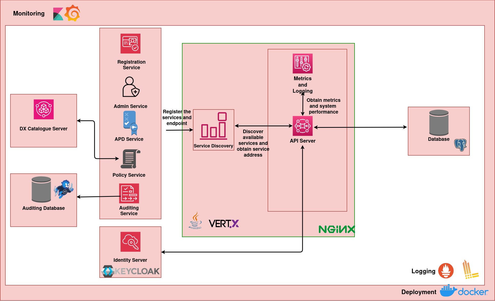

# Solution Architecture

</img>

## Vert.x

The AAA server has been written in the [Vert.x](https://vertx.io/) Java framework. All major components of the server have been divided into [Vert.x verticles](https://vertx.io/docs/vertx-core/java/#_verticles).

## Internal Server Architecture

The various components of the AAA server are organized into Vert.x verticles based on functionalities and APIs. These verticles are exposed as services and rely on service discovery to discover each other. See [Vert.x Service Proxy](https://vertx.io/docs/vertx-service-proxy/java/) and [Vert.x cluster managers](https://vertx.io/docs/vertx-core/java/#_cluster_managers) for more information.

A basic description of each service is as follows:

- **Registration Service** : Handles APIs related to role management, user management and client credentials management. 
- **Admin Service** : Handles APIs related to resource server registration and provider approval.
- **Token Service** : Handles all APIs related to tokens (creation, revocation, introspection etc.)
- **Policy Service** : Handles APIs related to delegation. Also has internal methods for resource access decisions.
- **APD Service** : Handles APIs related to APD management. Also has internal methods for AAA-to-APD interactions for resource access decisions.
- **Auditing Service** : Handles auditing of successful API calls in the auditing database.

## External Dependencies

### DX Catalogue Server

The AAA server depends upon the DX catalogue server for issuing tokens to obtain information about a requested resource. The main APIs used by the AAA server are the [Entity - Get Item API](https://redocly.github.io/redoc/?url=https://raw.githubusercontent.com/datakaveri/iudx-catalogue-server/master/docs/openapi.yaml#tag/Entity/operation/get%20item) and the [Relationship - Get Related Entity API](https://redocly.github.io/redoc/?url=https://raw.githubusercontent.com/datakaveri/iudx-catalogue-server/master/docs/openapi.yaml#tag/Relationship/operation/get%20related%20entity)

### Identity Server - Keycloak

[Keycloak](https://www.keycloak.org/) is used for identity management i.e. SSO login, password management, user information management etc. in the DX ecosystem. Most AAA APIs require Keycloak token authorization, which makes it necessary for users to be registered on Keycloak to interact with the AAA server.

Since Keycloak stores user information, the AAA server makes use of the Java [Keycloak Admin Client](https://www.keycloak.org/securing-apps/admin-client) to fetch user information like names and email addresses and to search for users based on email addresses or user IDs. Refer to [KcAdmin.java](src/main/java/iudx/aaa/server/registration/KcAdmin.java) to see how the AAA server interacts with Keycloak.

### PostgreSQL 

The AAA server makes use of the [PostgreSQL](https://www.postgresql.org/) relational database to store all information. The tables in PostgreSQL are managed using migrations with [Flyway](https://www.red-gate.com/products/flyway/community/) and migrations are present in `src/main/resource/db/migration`

#### Exploring the PostgreSQL Schema

To explore the different tables and relations in the schema, please use a tool like [SchemaSpy](https://schemaspy.org/) on an existing database where all Flyway migrations have been applied.

### ImmuDB

[ImmuDB](https://immudb.io/) is used as the database to store all successful API calls for auditing purposes. 

## Monitoring and Logging

[Micrometer metrics](https://vertx.io/docs/vertx-micrometer-metrics/java/) are exposed by the AAA server for monitoring. Prometheus and Grafana are used to collect and display metrics respectively.

[Log4J](https://logging.apache.org/log4j/2.x/index.html) is used for logging. The logging configuration can be found [here](src/main/resources/log4j2.xml). [Loki](https://grafana.com/docs/loki/latest/) and [Grafana](https://grafana.com/oss/grafana/) are used to collect and display logs respectively.

## Deployment

Docker images of the AAA server are available.
